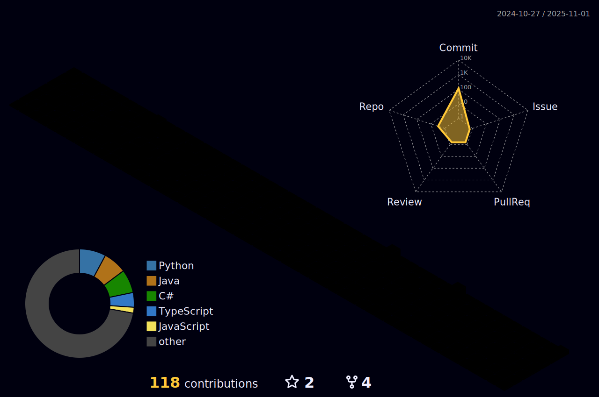

<!--  -->

   

  

 <a href="https://github.com/anuraghazra/github-readme-stats">
  

 <a href="https://git.io/streak-stats">

 
 

<h2 align='center'><i><a href="https://github.com/Ashutosh00710/github-readme-activity-graph">Activity Graph 📈</i></h2>

<!--

-->

<!-- 

  -->

  
 

<!--    -->

 

  

<!--START_SECTION:waka-->
<!--END_SECTION:waka-->

<h2 align='center'><i>Languages</i></h2>

<h2 align='center'><i>Tools</i></h2>

  

<h2 align='center'><i>💬 Contacts</i></h2>

<!--
 
-->

<!--
**lala9663/lala9663** is a ✨ _special_ ✨ repository because its `README.md` (this file) appears on your GitHub profile.

Here are some ideas to get you started:

- 🔭 I’m currently working on ...
- 🌱 I’m currently learning ...
- 👯 I’m looking to collaborate on ...
- 🤔 I’m looking for help with ...
- 💬 Ask me about ...
- 📫 How to reach me: ...
- 😄 Pronouns: ...
- ⚡ Fun fact: ...
-->
